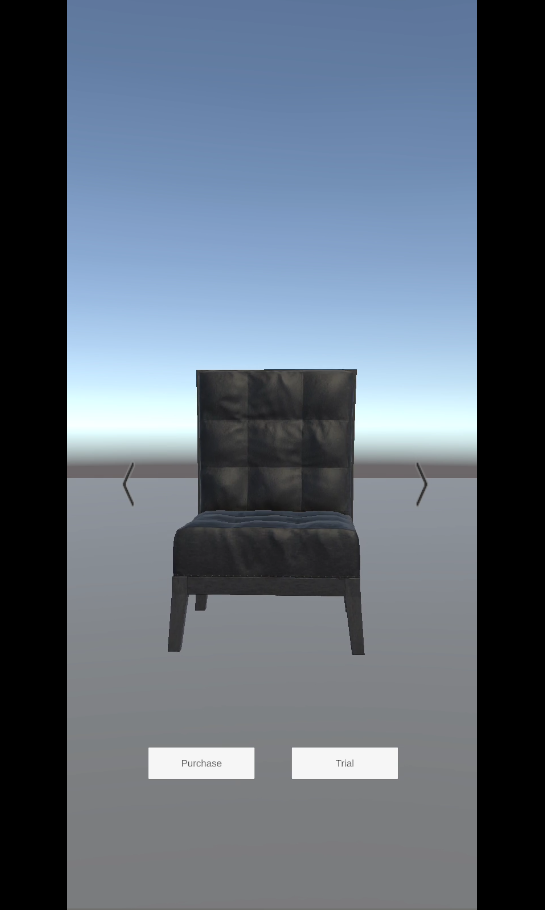
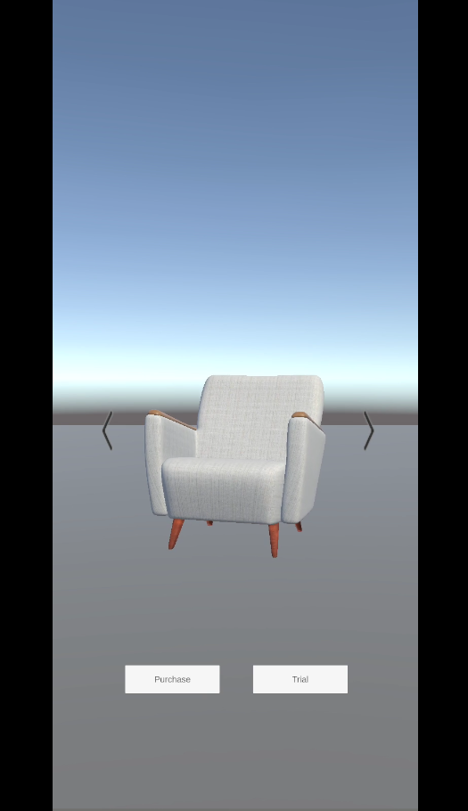
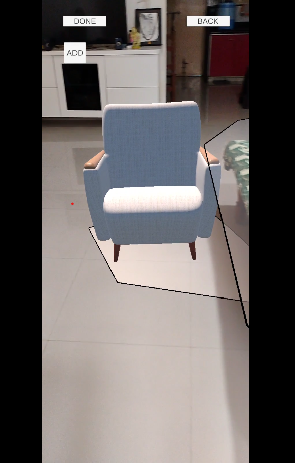

<h1>Augmented Reality Furniture Placement Application</h1>
 
 
An interactive Augmented Reality (AR) application designed to place 3D furniture in real-world environments. This project demonstrates the seamless integration of AR technology with intuitive user interactions to enhance the shopping and trial experience for users.

<h3> Features </h3>
<ul>
  <li>3D Furniture Placement: Users can visualize furniture in various environments with adjustable positions and scales.</li>
  <li>Interactive AR Environment: Real-time interactions with furniture models to test their appearance and fit in spaces.</li>
  <li>Custom 3D Models: Incorporates open-source furniture designs to offer a wide range of styles.</li>
  <li>Game Mechanics: Built with Unity Engine and C# scripting, leveraging robust AR capabilities.</li>
</ul>

<h3> Tech Stack </h3>
<ul>
  <li>Engine: Unity Game Engine</li>
  <li>Programming Language: C#</li>
  <li>Technology: Augmented Reality</li>
  <li>Resources: Open-source 3D furniture models</li>
</ul>

[Demo Video and Application are here](Build)

Mobile Application Snapshot 1

Mobile Application Snapshot 2

Mobile Application Snapshot 3

